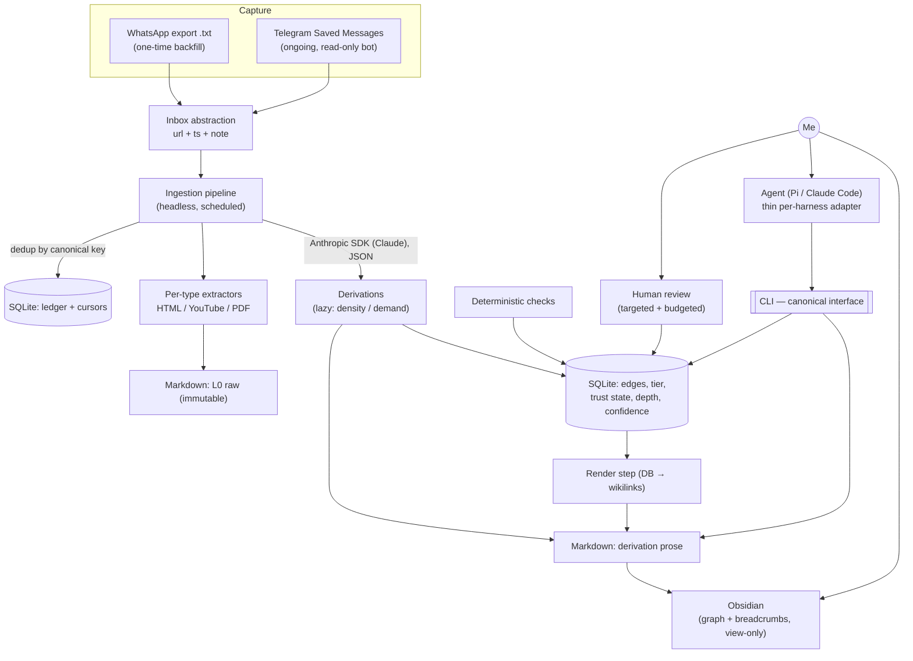

# memex — Design Context

> Personal wiki / second brain. Ingests links I save (articles, videos, blog posts),
> pre-computes and structures their knowledge with rigorous source citation, organized
> by **category** and by **level of abstraction**, so an agent can navigate it efficiently.
>
> Status: **design locked, pre-implementation.** This file is the source of truth for
> *why* the system is shaped the way it is. Decisions below (D1…D13) were settled in a
> grilling session and should not be silently reversed — amend with a new decision instead.

---

## 1. Vision in one paragraph

Today I dump interesting links into my own WhatsApp chat and never read them. memex turns
that graveyard into a compounding knowledge base. An ingestion pipeline pulls saved links,
stores the raw source immutably (Layer 0), and an agent builds **derivations** on top of it
at increasing levels of abstraction. Everything is **auditable**: any derivation traces back
through provenance links to the raw source it came from. I primarily *consult the high-level
derivations*; an agent navigates the structure top-down and stops as early as it can (fewer
tokens, less context pollution). A second class of links — associative — lets the agent
connect distant concepts for serendipity, without ever polluting the citation chain.

Inspired by Karpathy's personal wiki and by `iusztinpaul/ai-research-os-workshop` (analyzed
as a reference — see §6). More ambitious than the reference on the knowledge model
(arbitrary-depth DAG + validation states), more conservative on scope (single user, no
discovery/web-research subsystem).

---

## 2. Domain glossary (ubiquitous language)

- **Node** — a unit of knowledge. Either a raw source (L0) or a derivation.
- **L0 / raw source** — the original ingested document. **Immutable.** Markdown.
- **Derivation** — an LLM-produced node built from one or more lower nodes. Mutable, regenerable.
- **Provenance edge** (`derived_from`) — vertical, mandatory, **acyclic** (DAG). The audit
  backbone; the *only* thing that can justify a claim. Points downward toward sources.
- **Association edge** (`related` | `contradicts` | `refines`) — lateral, optional, lower-trust,
  may be cyclic/cross-tier/cross-domain. For discovery, **never** counts as claim support.
- **Tier (abstraction rank)** — explicit, named ordinal rank a derivation declares
  (e.g. `raw → notes → synthesis`). The stable navigation handle ("give me the high level").
- **Kind** — what a derivation *is* (summary, comparison, definition, critique, open-question…).
  Orthogonal to tier; emergent vocabulary.
- **Depth** — the computed `max(parent depth)+1` over the provenance DAG. Stored as an audit
  signal, not a navigation handle.
- **Trust state** — `draft → auto-verified → human-approved → stale`. Gates whether the agent
  may stop on a node.
- **Inbox** — source-agnostic abstraction over captured items (`url + timestamp + optional note`).
- **Ledger** — record of canonical keys already ingested (idempotency / correctness).
- **Cursor** — per-source watermark of "where I left off" (efficiency).
- **Canonical key** — normalized URL or platform id (`youtube://<id>`); the dedup key.

---

## 3. Architecture map

**Two-store ownership (D10):** SQLite owns *structure*, markdown owns *content*, joined by a
stable node id. Frontmatter mirrors relations for Obsidian, but SQLite is authoritative for
those fields.

---

## 4. Decisions

**D1 — Primary consumer is an agent (mode B), not a human reader.**
I query in natural language; an agent answers with citations. The readable Obsidian markdown
is a *by-product*, not the product. What I personally consult most are the high-level derivations.
*Why:* "facilitate the agent" + "rigorous citation" are requirements of an interrogable corpus,
not a curated blog. Optimizing for B yields A for free; the reverse dies by manual-editing attrition.

**D2 — Abstraction level = hybrid (named tier + computed depth).**
Each derivation declares an explicit, named semantic **tier** (what I navigate by). The system
*also* stores the computed DAG **depth** as a deterministic audit signal to catch inconsistencies
(e.g. a "cross-domain thesis" with a single raw parent → flag for review).
*Why:* pure computed depth is meaningless to a human ("level 5" says nothing); pure declared
tier drifts. Hybrid gives a meaningful, navigable handle and a deterministic audit check.

**D3 — Tier vocabulary: small fixed ordinal spine + emergent, human-gated growth.**
Separate two things "tier" conflates: the **ordinal abstraction rank** (fixed, tiny, the stable
navigation handle — start with `raw → notes → synthesis`) vs the **kind** (summary/comparison/…,
open and emergent). Finer tiers may emerge but enter the canonical vocabulary *only* through a
human-approval gate — the same correctness gate used for derivations.
*Why:* fixed-set fails by needing a re-tag (mechanical); emergent-folksonomy fails by
uncontrolled proliferation (a swamp, expensive to clean). The asymmetry favors seed-minimal +
governed growth. "Arbitrary number of levels" is satisfied by arbitrary **DAG depth** + the
open kind facet, not by an unbounded rank vocabulary.

**D4 — Levels are created lazily, on a dual trigger.**
A higher derivation materializes only when (1) **density** — enough lower material accumulates to
be worth synthesizing (echo of the reference's "≥2 sources" rule), or (2) **demand** — repeated
queries hit a region, so caching a high-level synthesis repays. No eager pyramids over thin material.
*Why:* extra levels are not free (telephone-game fidelity loss, maintenance, staleness propagation).
Concentrate the token-saving benefit where it actually pays. **Cold start on first query into a
cold area is accepted** — personal project.

**D5 — Trust state machine; trust gates the agent's right to stop.**
Each node: `draft → auto-verified → human-approved → stale`. **The agent may stop on a node only
if it is ≥ `auto-verified`**; otherwise it must descend. If it stops on a non-`human-approved` node
for a consultation I care about, the answer is marked low-confidence and the node is queued for review.
*Why:* this is the direct mitigation for "stop early on subtly-wrong synthesis" (the telephone game).
Deterministic checks (cheap end of the spectrum): every claim has a resolvable provenance link
(no floating claims); no dangling refs; declared tier consistent with provenance pattern; node not
stale vs parents; `> Synthesis:` marker present for non-sourced claims; size/scope bounds.

**D6 — Human review is targeted and budgeted, via a configurable policy.**
Review is mandatory only for (a) the **high tiers I actually consult** and (b) **risk triggers**:
failed deterministic check, detected contradiction, low confidence (few/conflicting sources), or
tier over-claim. Low tiers stop at `auto-verified`. Intensity is a **policy with knobs** (which
tiers need approval, active risk triggers, mode = batch/on-consultation/sampled, per-session review
budget). Default = parsimonious (on-consultation, high tiers only) and must work out-of-the-box.
*Why:* my review time is the scarcest resource; reviewing everything kills the system by attrition
(the WhatsApp death). Configurable so I can tighten over time.

**D7 — Two typed edge classes, never interchangeable. "Associations inspire, provenance justifies."**
Provenance (`derived_from`): vertical, mandatory, acyclic, sole basis for claim support.
Association (`related` | `contradicts` | `refines`): lateral, optional, lower-trust, cyclic OK,
carries a rationale and a `suggested`(agent) / `confirmed`(me) state, **never** counts as support.
The agent may *traverse* associations to bring in distant concepts, but anything it then *asserts*
must be re-grounded via provenance or marked `> Synthesis:`. `contradicts` feeds the D6 risk triggers.
Start with the 3 typed relations; more emerge gated (D3).
*Why:* mixing them either lets speculation count as proof (audit breaks) or forbids creative links
(kills serendipity). Typing keeps both.

**D8 — Capture: drop WhatsApp going forward; Telegram is the ongoing channel.**
One-time WhatsApp `.txt` export backfills existing links. Future capture moves to **Telegram Saved
Messages** (same "forward a link to myself" habit, but a real API). An **inbox abstraction** decouples
capture from ingest — the core only sees `url + ts + note`, so the source is swappable.
*Why:* WhatsApp automation violates ToS and risks a ban on my personal number; manual export is
forever-manual. The precious habit is "forward a link to myself," not "WhatsApp" — Telegram replicates
it and adds automation.

**D9 — Idempotent, non-destructive ingestion.**
Two overlapping mechanisms: **canonical key** (normalized URL / `youtube://id`) in a **ledger** =
correctness (never double-ingest, always know what's pending); **per-source cursor** (Telegram last
message id; WhatsApp file marked done) = efficiency. Telegram is **left intact** — ingestion state
lives in our external ledger, the bot is **read-only** for v1. "Not yet ingested" = items past the
cursor / keys without an L0 node. Optional ✅-reaction confirmation deferred.
*Why:* idempotency survives re-exports and cross-source duplicates; non-destructive means no bot ever
deletes something I wanted, and raw stays archived in Telegram too.

**D10 — Two stores, clean ownership, joined by a stable node id.**
**SQLite owns structure** (provenance + association edges, tier, trust state, computed depth,
confidence, ledger, cursors) → queries, traversal, staleness propagation, and checks become
deterministic, testable code. **Markdown files own content** (L0 raw + derivation prose) →
human-editable in review, git-diffable, Obsidian-browsable. Frontmatter mirrors relations for
Obsidian; SQLite is authoritative for those fields.
*Why:* pure-markdown (the reference) forces the agent to read files (token cost, scaling weakness)
and makes staleness/traversal painful. Accepted cost: two stores kept in sync by disciplined
regeneration/render. Rejected the plaintext-purist alternative because I accumulate years of links
(volume argues against it).

**D11 — Obsidian graph is maintained, as a one-way projection.**
A render step writes SQLite edges as `[[wikilinks]]` into frontmatter, so the graph always reflects
truth (DB → markdown, one-way). **Associations → graph-view** (serendipity); **provenance →
Breadcrumbs** hierarchy; node groups color by tier/type. Obsidian is a *human convenience, not
load-bearing* (consumer is the agent, D1). The global graph is a hairball at scale — value is the
local graph + breadcrumbs.

**D12 — Framework-agnostic Python core; no LangGraph.**
Core = a plain, testable Python library over SQLite (ingest, dedup, index, staleness, checks,
render). Ingestion = a **headless scheduled pipeline** (cron) whose generative steps call the
**Anthropic SDK (Claude)** with structured JSON output (testable with mocked responses).
Consultation = an agentic loop. **No LangGraph**: the pipeline is a mostly-linear deterministic
chain with a few LLM calls, not a complex cyclic multi-agent graph — using it here would be
framework-by-default, not problem-driven.

**D13 — CLI is the canonical, harness-agnostic interface. No MCP.**
The consultation surface is a well-designed **CLI** over the core (AXI standards: predictable
commands, structured JSON output, clear errors, token-frugal). Any harness — Pi, Claude Code,
custom — drives the same CLI; the per-harness adapter is paper-thin glue. Switching harness leaves
core + interface untouched. **MCP rejected** as too much for a single user (and it needs harness
support, the CLI doesn't).

---

## 5. Open questions / deferred

- **Model choice & cost:** default to latest capable Claude (Opus 4.8 / Sonnet 4.6). Likely Sonnet
  for bulk derivation, Opus for high-tier synthesis — tune later.
- **Tier seed:** start with `raw → notes → synthesis`; let real use reveal whether more ordinal
  ranks are needed (gated, D3).
- **Source-type extractors:** HTML article, YouTube transcript, PDF first; tweets/X, others later.
- **Edit round-trip:** if I hand-edit a wikilink in Obsidian, a reconcile step is needed (edge case).
- **Staleness propagation policy:** invalidate-eagerly vs mark-and-regenerate-on-demand — lean
  on-demand, confirm during build.
- **✅-reaction** Telegram confirmation: optional later enhancement (needs write scope).
- **Confidence scoring:** how `confidence` (high/med/low) is computed from source count + contradictions.

## 6. Reference: `iusztinpaul/ai-research-os-workshop`

Steal: two-axis organization (category × abstraction ladder), index-as-retrieval (no vector DB),
no-floating-claims + `> Synthesis:` marker, stable per-type URI scheme as dedup key, ≥2-source
promotion threshold, immutable-raw/mutable-wiki split, orchestrator-never-reads-raw, query-grows-the-wiki.
Avoid: discovery rounds / gap-analyzer / mode-routing ceremony, multi-source-CLI sprawl, prompt-defined
load-bearing structure (we move it to code, D10/D12), pure-index scaling limits.

## 7. Non-goals

- Web discovery / autonomous research (I ingest *already-saved* links).
- Multi-user, sharing, publishing.
- Real-time WhatsApp automation.
- MCP server, LangGraph, vector DB (unless a concrete need proves otherwise).
