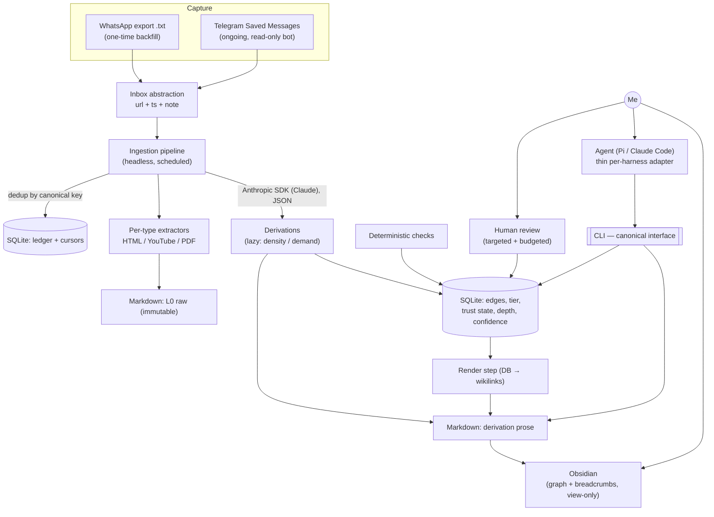

# memex — Architecture Overview

Design overview and rationale map. For precise term definitions see [`../CONTEXT.md`](../CONTEXT.md);
for the *why* behind each decision see the ADRs in [`adr/`](adr/).

## Vision

Today I dump interesting links into my own WhatsApp chat and never read them. memex turns that
graveyard into a compounding knowledge base. An ingestion pipeline pulls saved links, stores the
raw source immutably (L0), and an agent builds **derivations** on top at increasing levels of
abstraction. Everything is **auditable**: any derivation traces back through provenance links to
the raw source. I primarily consult the high-level derivations; an agent navigates top-down and
stops as early as it can (fewer tokens, less context pollution). A second class of links —
associative — lets the agent connect distant concepts for serendipity, without ever polluting the
citation chain.

Inspired by Karpathy's personal wiki and by `iusztinpaul/ai-research-os-workshop` (see below).
More ambitious than the reference on the knowledge model (arbitrary-depth DAG + validation states),
more conservative on scope (single user, no discovery/web-research subsystem).

## Map

## Decisions (ADR index)

- [0001](adr/0001-primary-consumer-is-an-agent.md) — Primary consumer is an agent, not a human reader
- [0002](adr/0002-abstraction-tier-plus-depth.md) — Abstraction = declared named tier + computed depth, small fixed spine
- [0003](adr/0003-lazy-derivation-creation.md) — Derivations are created lazily (density/demand trigger)
- [0004](adr/0004-trust-state-gates-retrieval.md) — Trust-state machine gates the agent's stop; targeted review
- [0005](adr/0005-two-typed-edge-classes.md) — Two typed edge classes: provenance vs association
- [0006](adr/0006-telegram-capture-inbox-abstraction.md) — Telegram capture via inbox abstraction; WhatsApp dropped
- [0007](adr/0007-idempotent-nondestructive-ingestion.md) — Idempotent, non-destructive ingestion (canonical key + cursor)
- [0008](adr/0008-two-store-sqlite-markdown.md) — Two-store: SQLite owns structure, markdown owns content
- [0009](adr/0009-framework-agnostic-core-no-langgraph.md) — Framework-agnostic Python core; no LangGraph
- [0010](adr/0010-cli-canonical-interface-no-mcp.md) — CLI as canonical harness-agnostic interface; no MCP

## Open questions (deferred)

- **Model choice & cost:** default to latest capable Claude (Opus 4.8 / Sonnet 4.6); likely Sonnet for bulk derivation, Opus for high-tier synthesis — tune later.
- **Tier seed:** start with `raw → notes → synthesis`; let real use reveal whether more ordinal ranks are needed (gated, ADR-0002).
- **Source-type extractors:** HTML article, YouTube transcript, PDF first; tweets/X and others later.
- **Edit round-trip:** if I hand-edit a wikilink in Obsidian, a reconcile step is needed (edge case).
- **Staleness propagation:** invalidate-eagerly vs mark-and-regenerate-on-demand — leaning on-demand; confirm during build.
- **✅-reaction** Telegram confirmation: optional later enhancement (needs write scope).
- **Confidence scoring:** exact formula from source count + contradictions.

## Reference: `iusztinpaul/ai-research-os-workshop`

**Steal:** two-axis organization (category × abstraction ladder), index-as-retrieval (no vector DB),
no-floating-claims + `> Synthesis:` marker, stable per-type URI scheme as dedup key, ≥2-source
promotion threshold, immutable-raw / mutable-wiki split, orchestrator-never-reads-raw,
query-grows-the-wiki.

**Avoid:** discovery rounds / gap-analyzer / mode-routing ceremony, multi-source-CLI sprawl,
prompt-defined load-bearing structure (we move it to code — ADR-0008/0009), pure-index scaling limits.

## Non-goals

- Web discovery / autonomous research (I ingest *already-saved* links).
- Multi-user, sharing, publishing.
- Real-time WhatsApp automation.
- MCP server, LangGraph, vector DB — unless a concrete need later proves otherwise.
