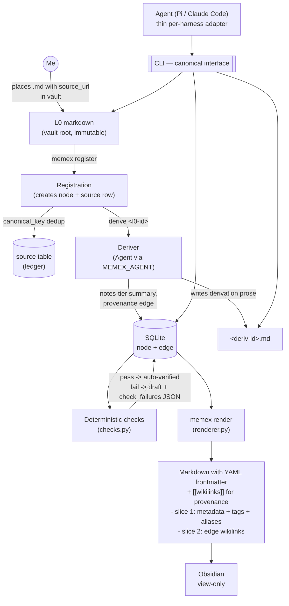

# memex — Architecture Overview

Design overview and rationale map. For precise term definitions see [`../CONTEXT.md`](../CONTEXT.md);
for the *why* behind each decision see the ADRs in [`adr/`](adr/).

## Vision

I collect interesting links by saving them to the vault as markdown files. memex reads those files,
registers them as raw sources (L0), and an agent builds **derivations** on top at increasing levels of
abstraction. Everything is **auditable**: any derivation traces back through provenance links to
the raw source, which carries a ``source_url`` reference to the original. I primarily consult the
high-level derivations; an agent navigates top-down and stops as early as it can (fewer tokens,
less context pollution). A second class of links — associative — lets the agent connect distant
concepts for serendipity, without ever polluting the citation chain.

Inspired by Karpathy's personal wiki and by `iusztinpaul/ai-research-os-workshop` (see below).
More ambitious than the reference on the knowledge model (arbitrary-depth DAG + validation states),
more conservative on scope (single user, no discovery/web-research subsystem).

## Status (what is built vs planned)

| Concern | State | Surface |
|---|---|---|
| L0 registration (file -> node + source row) | **built** | `memex register <path>` |
| Canonical-key dedup + ledger | **built** | Store: `lookup_by_canonical_key`, `source.failed` |
| Derivation (LLM -> notes-tier + provenance edge) | **built** | `memex derive <l0-id>` |
| Deterministic checks (auto-verify gate) | **built** | `memex.checks.run_checks` |
| Keyword search over derivations | **built** | `memex search <query>` |
| Store deep module (CLI is thin) | **built** | `memex.store.Store` |
| URL resolution (advisory for external agents) | **built** | `memex resolve <url>` |
| Lazy derivation trigger | demand only (ADR-0003) | `memex derive`/`synthesize` on explicit action |
| Render step (DB -> frontmatter + wikilinks for Obsidian) | **built** | `memex render` |
| L0 markdown in vault root (Obsidian-indexable) | **built** | User places files; register points to them |
| Structured `synthesis_statements` column | **built** | Agent emits JSON; renderer surfaces in frontmatter |
| `memex list --synthesis-statement` filter | **built** | Substring match against the structured column |
| `memex backfill-synthesis` migration | **built** | One-shot CLI for legacy vaults |
| Cross-device vault sharing (git + env vars) | **built** | `MEMEX_VAULT` / `MEMEX_DB` env vars (ADR-0015) |

## Map (as built)

Solid lines = implemented path; dashed = planned surface that doesn't yet write data.

## Decisions (ADR index)

- [0001](adr/0001-primary-consumer-is-an-agent.md) — Primary consumer is an agent, not a human reader
- [0002](adr/0002-abstraction-tier-plus-depth.md) — Abstraction = declared named tier + computed depth, small fixed spine
- [0003](adr/0003-lazy-derivation-creation.md) — Derivations are created lazily (density/demand trigger)
- [0004](adr/0004-trust-state-gates-retrieval.md) — Trust-state machine gates the agent's stop; targeted review
- [0005](adr/0005-two-typed-edge-classes.md) — Two typed edge classes: provenance vs association
- [0006](adr/0006-telegram-capture-inbox-abstraction.md) — Telegram capture via inbox abstraction; WhatsApp dropped
- [0007](adr/0007-idempotent-nondestructive-ingestion.md) — Idempotent, non-destructive ingestion (canonical key + cursor)
- [0008](adr/0008-two-store-sqlite-markdown.md) — Two-store: SQLite owns structure, markdown owns content
- [0009](adr/0009-framework-agnostic-core-no-langgraph.md) — Framework-agnostic Python core; no LangGraph
- [0010](adr/0010-cli-canonical-interface-no-mcp.md) — CLI as canonical harness-agnostic interface; no MCP
- [0011](adr/0011-deterministic-checks-gate.md) — Deterministic Checks module + `> Synthesis:` gate
- [0012](adr/0012-staleness-propagation-via-contested.md) — Staleness propagation via contested state and human review
- [0013](adr/0013-fetcher-router-per-type-extractors.md) — Fetcher router with per-type content extractors
- [0014](adr/0014-synthesis-tier-and-trust-cascade.md) — Synthesis tier command and trust state cascade on parent regression
## Open questions (deferred)

- **Model choice & cost:** `AnthropicAgent` currently defaults to `claude-opus-4-5`. Switch to Sonnet for bulk derivation once cost matters; keep Opus for higher-tier synthesis. Tune when real volume arrives.
- ~~**Edit round-trip:** if I hand-edit a wikilink in Obsidian, a reconcile step is needed (edge case).~~ **By design:** Obsidian is view-only. Render is unidirectional (ADR-0008).
- **Confidence scoring:** exact formula from source count + contradictions. (ADR-0014 covers trust state, not confidence — separate problem.)
- ~~**Staleness propagation:** invalidate-eagerly vs mark-and-regenerate-on-demand.~~ **Resolved** (ADR-0012).

## Reference: `iusztinpaul/ai-research-os-workshop`

**Steal:** two-axis organization (category × abstraction ladder), index-as-retrieval (no vector DB),
no-floating-claims + `> Synthesis:` marker, stable per-type URI scheme as dedup key, ≥2-source
promotion threshold, immutable-raw / mutable-wiki split, orchestrator-never-reads-raw,
query-grows-the-wiki.

**Avoid:** discovery rounds / gap-analyzer / mode-routing ceremony, multi-source-CLI sprawl,
prompt-defined load-bearing structure (we move it to code — ADR-0008/0009), pure-index scaling limits.

## Non-goals

- Web discovery / autonomous research (I place *already-saved* content in the vault).
- Multi-user, sharing, publishing.
- Real-time WhatsApp automation.
- MCP server, LangGraph, vector DB — unless a concrete need later proves otherwise.
