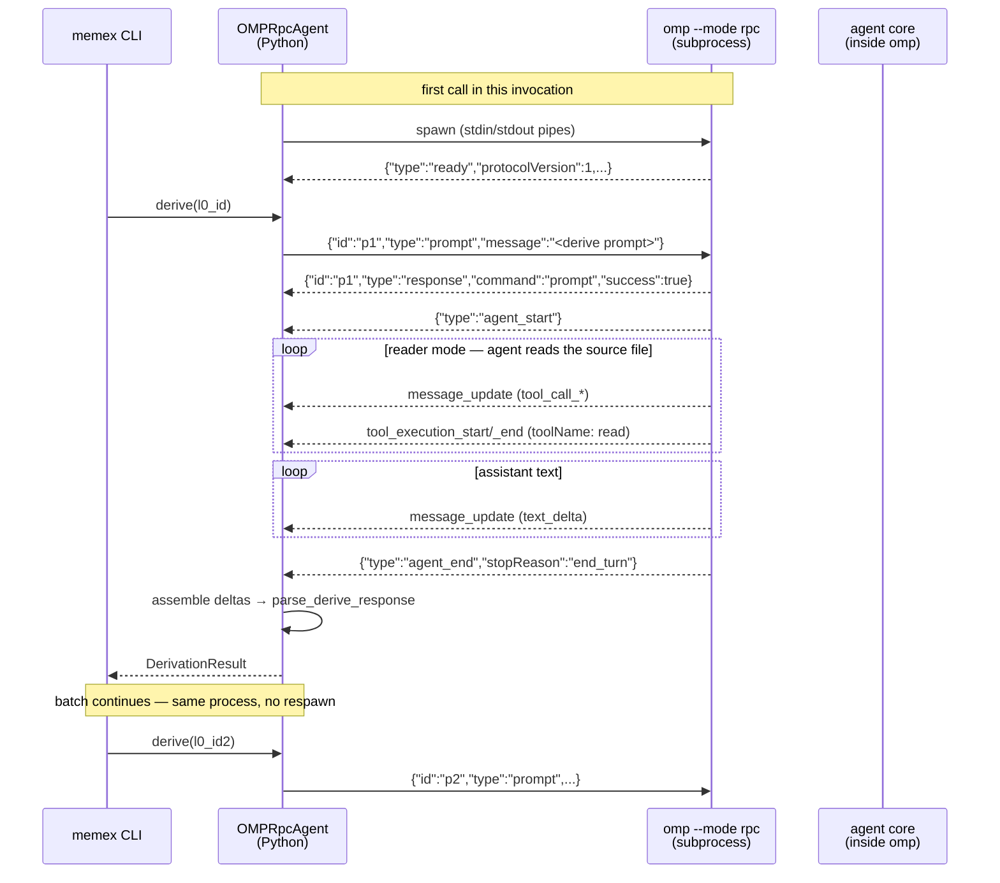
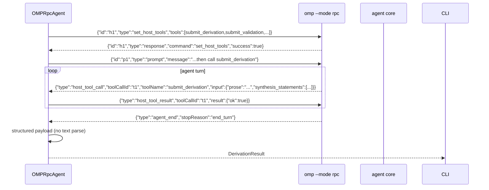
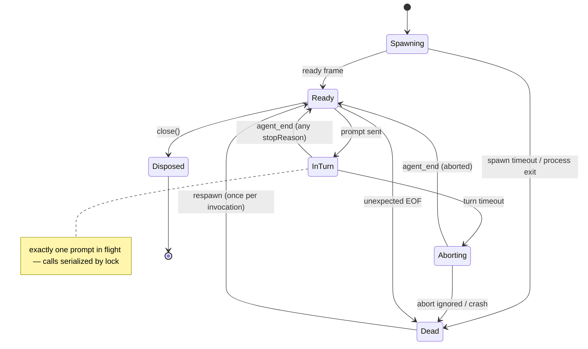

# PRD: Agent via omp RPC service

## Problem Statement

`memex.derivers.pi:OMPAgent` calls the agent as a **one-shot subprocess per call**:
`omp -p --mode json --no-session`, wait for process exit, parse JSONL stdout, extract the
last `message_end` text. Observed limits (2026-08-05, vault batch of 23 derivations):

1. **Boot per call** — the Rust engine + discovery + model registry start from zero for
   every node: ~20s/node (458s for 23 nodes), most of it not LLM time.
2. **Fragile text parsing** — the agent produces text; JSON is extracted afterwards
   (`parse_derive_response`, `_extract_json_object`). The adversarial validator
   (`MEMEX_VALIDATOR`) hit exactly this: *"Validator response parse failed, validation
   skipped"* — non-JSON text from the model silently downgraded the gate to pass-with-warning.
3. **No streaming / no abort** — the subprocess blocks until `message_end`; a 300s
   `timeout=` is the only escape hatch. No `steer`, no graceful `abort`, no `compact`.
4. **No structured results** — the agent can only use its own tools (`--tools=read`);
   there is no way to receive a typed payload (prose + synthesis_statements) other than
   text.

The omp product exposes the agent core through three surfaces: the SDK
(`@oh-my-pi/pi-coding-agent`, TypeScript/Bun, in-process for Bun hosts — not embeddable
from CPython: 774 `Bun.*` API uses, `bun:sqlite` in the session store, no maintained
Bun-capable JS-in-CPython embedder), **RPC mode** (`omp --mode rpc`, NDJSON over stdio,
the documented path for non-Node hosts), and the one-shot `--mode json` print mode (a
degenerate case of the same wire). This PRD adopts **RPC mode**: a long-lived omp process
per memex invocation, speaking the official protocol.

## Solution

`OMPRpcAgent` (new class, `memex.derivers.pi`), drop-in for the `Agent` seam:

- **Lazy spawn** of `omp --mode rpc --no-session --tools=read` on first `call_llm`;
  wait for the `ready` frame.
- **Reuse** across all calls in one CLI invocation (`derive --all` = one process);
  dispose on exit (`atexit`), restart once on crash.
- `call_llm(prompt, *, allow_read) -> str` keeps its signature: sends `prompt`, collects
  `message_update` text deltas, returns the assembled turn text on `agent_end`. Reader
  mode (`can_read_files=True`) preserved — the process runs with the read tool.
- **Turn timeout** (default 600s): `abort` command, then SIGTERM, then SIGKILL; the call
  fails with `error`, never hangs.
- **Phase 2 — host tools** (**implemented 2026-08-05**): typed `submit_derivation` /
  `submit_ideas` / `submit_review` / `submit_validation` tools via `set_host_tools`. The
  agent calls them with structured args (JSON Schema); the host replies `host_tool_result`;
  at `agent_end` the structured payload wins, text parsing becomes fallback only. The
  validator's "response parse failed → pass-with-warning" downgrade is gone: the verdict
  arrives as a typed `passes` boolean or the fallback JSON text is parsed as before.
- **Ratified**: one-shot `OMPAgent`/`PiAgent` are **removed** — no second convention.
  No schema changes, no new DB state (pre-persistence plumbing).

## System Architecture

### Interaction flow — happy path (reader mode)



### Interaction flow — phase 2 (host tools)



### Session lifecycle (state machine)



### Endpoint contracts (wire subset used)

```text
Spawn: omp --mode rpc --no-session --tools=read
  Readiness: first stdout line = {"type":"ready",...} within
             MEMEX_OMP_STARTUP_TIMEOUT (default 30s), else error.

Requests (stdin, one JSON object per line, each with id):
  prompt          { id, type:"prompt", message: string, images?: [...] }
  steer           { id, type:"steer", message: string }            (future)
  abort           { id, type:"abort" }
  set_host_tools  { id, type:"set_host_tools", tools: RpcHostToolDefinition[] }  (phase 2)

Responses (echo id):
  { id, type:"response", command:"<cmd>", success: bool }

Events (stdout):
  agent_start    { type:"agent_start" }
  message_update { type:"message_update",
                   assistantMessageEvent:{ type:"text_delta"|"thinking_delta"|
                                           "tool_call_start"|"tool_call_delta"|
                                           "tool_result", ... } }
  tool_execution_start/_update/_end  { type, toolCallId, toolName, intent? }
  agent_end      { type:"agent_end", stopReason:"end_turn"|"aborted"|"error"|... }
  extension_ui_request  { type, id, method:"setWidget"|"selector"|"confirm"|"open_url"|"input", ... }
  host_tool_call        { type:"host_tool_call", toolCallId, toolName, input }   (phase 2)
  available_commands_update  (ignore), auto_compaction_* / auto_retry_* (log only)

Reply to extension_ui_request:
  { type:"extension_ui_response", id, value } | { ..., confirmed:bool } | { ..., cancelled:true }
  Headless policy: setWidget ignored; selector/confirm/input/open_url → cancelled.
  Auth must pre-exist in ~/.omp (same discovery as the CLI).

Errors:
  startup timeout      → error "omp RPC did not become ready"
  EOF while InTurn     → error "omp RPC process exited mid-turn" (then respawn)
  turn timeout         → abort; no agent_end within grace (10s) → SIGTERM → SIGKILL
                         → error "turn timed out"
  non-zero exit        → error with stderr tail
```

Host tool definitions (phase 2, `RpcHostToolDefinition[]`; exact SDK schema mapped at
implementation):

```text
submit_derivation   { prose: string, synthesis_statements: string[] }
submit_ideas        { ideas: string[] }
submit_review       { affected_node_ids: string[],
                      damage_boundary_node_id: string|null,
                      rationale_md: string,
                      confidence: "high"|"medium"|"low" }
submit_validation   { passes: boolean, reason?: string }

Precedence: structured tool payload > text-parse fallback.
If the agent ends the turn without calling the tool, fall back to parsing the text
(the pre-RPC path) — never fail a good derivation because a tool call was skipped.
```

### Data model

None. The agent service is pre-persistence plumbing: no new columns, tables, or files.
`--no-session` keeps omp's own session store untouched (in-memory session per process).

### System invariants

| Invariant (law) | Negation → test | Verified in |
|---|---|---|
| At most one prompt in flight per RPC session | two `prompt` commands issued before the first `agent_end` | `tests/test_omp_rpc.py` |
| Every prompt terminates with exactly one `agent_end` (or abort) before the next starts | `agent_end` count ≠ completed-prompt count for a session | `tests/test_omp_rpc.py` |
| `call_llm` returns the full turn text or raises — never a partial/empty success | call returns text while the turn is still streaming | `tests/test_omp_rpc.py` |
| A crashed session never serves a call: the in-flight call fails, the session respawns | call returns text from a dead process | `tests/test_omp_rpc.py` |
| Turn timeout always terminates the call (abort → kill) | call blocks past `MEMEX_OMP_TIMEOUT` | `tests/test_omp_rpc.py` |
| Structured tool payload wins over text parse when both present | both available → parsed text used | `tests/test_omp_rpc.py` |
| One process serves the whole batch | spawn count > 1 for a `derive --all` run | `tests/test_derive_all.py` |

### Architecture notes

- **ADR-0017 proposed** — *"Agent as long-lived RPC service"*: captures the three
  observed failures (boot cost, text-parse fragility, no abort/streaming) and the choice
  of the official RPC wire over the one-shot mode. Promote the rationale from this PRD
  when the design is ratified.
- **Why not the SDK in-process**: the SDK is Bun-gated TypeScript (774 `Bun.*` uses,
  `bun:sqlite` in the session store); no maintained Bun-capable JS embedder for CPython
  exists (Pythonmonkey = SpiderMonkey/Node-compat, PyMiniRacer = bare V8). omp itself is
  the polyglot-in-one-process product (Rust + embedded Bun runtime, 188MB ELF), but it is
  a compiled binary — its Rust core is not published as an embeddable crate/C ABI, so a
  PyO3 wrapper is not possible today. RPC mode is the omp-documented surface for
  non-Node hosts.
- **Reader mode preserved**: the process runs with `--tools=read`. Review/validate prompts
  already forbid tool calls, so a read-enabled process is acceptable; the alternative (two
  pools, reader vs non-reader) is rejected for now — revisit only if a prompt leaks tools.
- **Session semantics**: `--no-session` = in-memory, matches today's cold-call semantics;
  a batch's per-turn contexts stay bounded. Future: persisted sessions per L0
  (resume/branch/compaction for long syntheses) — needs the file-backed session store;
  out of scope.
- **Frame handling**: one JSON object per line; tolerate lines up to
  `maxReassembledFrameBytes` (64MB, advertised in `ready`). No length-prefixed framing
  assumed beyond NDJSON.
- **Concurrency**: `derive_all` stays sequential; the client serializes prompts with a
  lock regardless (the wire carries one turn at a time). Parallel derive via N processes
  is a future option, out of scope.
- **New env vars**: `MEMEX_OMP_TIMEOUT` (turn timeout, default 600), `MEMEX_OMP_STARTUP_TIMEOUT`
  (default 30). Nothing else.
- **Testing**: hermetic fake `omp` executable (a Python script emitting the protocol
  frames) injected via PATH; `MEMEX_AGENT=memex.derivers.pi:OMPRpcAgent`. No network, no
  real LLM. The fake drives: readiness, ack, delta assembly, `agent_end`, abort path,
  crash/respawn, EOF, host-tool flow (phase 2).
- **Backwards compatibility (ratified)**: the one-shot `OMPAgent`/`PiAgent` classes are
  deleted; `OMPRpcAgent` is the only CLI-backed agent. README `MEMEX_AGENT` example
  points to `memex.derivers.pi:OMPRpcAgent`. Vault nodes are unaffected (the agent is
  stateless per node; re-derive uses whichever agent is configured).

## Out of Scope

- SDK-in-process embedding (infeasible from CPython today; see notes).
- Persisted omp sessions per node (resume/branch/compaction).
- Parallel derivation across multiple RPC processes.
- `steer`/`follow_up`/`set_model`/`set_thinking_level` wiring — the wire supports them;
  no memex surface uses them yet.
- Any DB or schema change.
